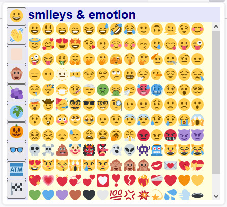

# QuickEmoji

A webextension emoji picker. Built using Svelte and Twemoji. 

  

## Compilation

To build the extension (requires node.js, npm):

`npm install`

`npm run build`

Output will be in `/extension` folder

## Installation 

### Firefox (debug mode):

This enables the addon temporarily (removes it when browser is closed):

* Navigate to `about:debugging#/runtime/this-firefox`
* Click **Load Temporary Add-on**
* Select `manifest.json` file from extension
